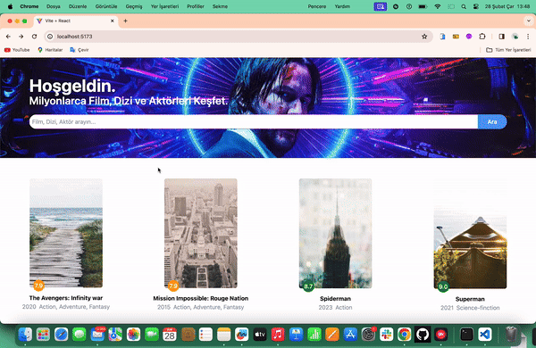

<h1> Fullstack-MovieApp  </h1>

A fullstack film project provides an interactive platform where users can add, update, and delete films. The project includes meticulously written code for both frontend (React) and backend (Node.js)

<h2> The technologies used in the project </h2>

# Backend
```bash
GET   /api/movies > bütün filmleri alır.
GET   /api/movies/:id > idsine göre bir filmi alır.
POST  /api/movies > yeni film ekler.
DELETE /api/movies/:id > idsine göre filmi kaldırır.
```
# Frontend
- react
- react-router-dom
- axios
- tailwind
- react-icons
- react-toastify

<h2> Demo </h2>

You can view a live demo of this project [here](fullstackmovieapp.netlify.app).

<h2> Screenshot </h2>



